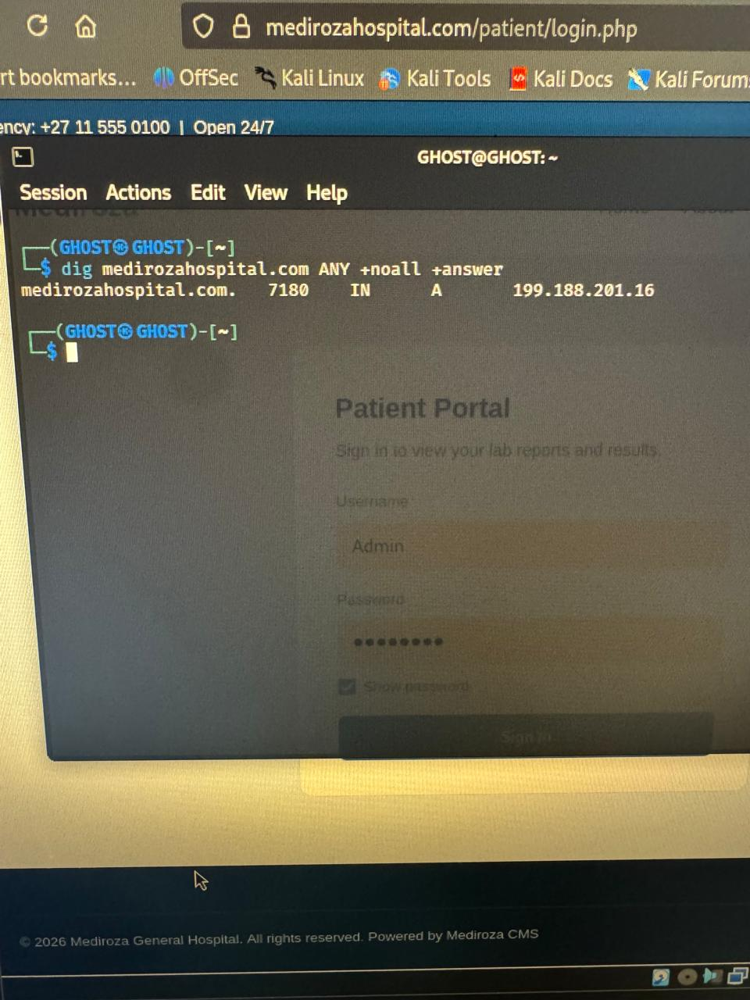

<div align="center">

# Mediroza General Hospital

# Professional Penetration Testing Report

# Pentester Name: Kovilen Sookalingum

</div>

<p align="center">
  <strong>Black-Box Web Application & Infrastructure Security Assessment</strong>
</p>

<p align="center">
  Authorized Security Testing &nbsp;|&nbsp;
  Ethical Hacking &nbsp;|&nbsp;
  Vulnerability Assessment &nbsp;|&nbsp;
  Security Documentation
</p>

---

## ⚠️ DISCLAIMER — AUTHORIZED USE ONLY ⚠️ 

> **IMPORTANT:** This project was conducted as an authorized cybersecurity assessment in a controlled environment.

All testing was performed for educational, security-assessment, and defensive purposes. The techniques, tools, commands, screenshots, and findings demonstrate penetration-testing methodology and security analysis.

No unauthorized access, disruption, destruction, or malicious activity was intended.

Testing followed the defined scope and rules of engagement. Denial-of-service and social-engineering activities were excluded.

Sensitive information from the original assessment must be redacted before publication.

 **Do not misuse this knowledge.** Unauthorized access to computer systems is illegal and punishable under law.  
The author, **Networkwalks**, and the **Instructor** will **not be responsible** for any misuse of this information.  
Every action you take is **your own responsibility**.

 ⚠️ Misuse can lead to:
 
- Criminal charges  
- Heavy fines  
- Loss of employment  
- A permanent criminal record 
    
---

# Executive Summary

This repository documents a controlled black-box penetration test of the **Mediroza General Hospital** environment.

The objective was to assess the security of externally accessible systems from an attacker's perspective.

The assessment followed:

```text
Reconnaissance
      ↓
Enumeration
      ↓
Authentication Testing
      ↓
Controlled Exploitation
      ↓
Data Exposure Assessment
      ↓
Risk Assessment
      ↓
Remediation
      ↓
Reporting
```

Several weaknesses were identified involving authentication, patient documents, PDF protection, database backups, and information disclosure.

### Overall Risk Rating

# CRITICAL

The findings represented a significant confidentiality risk due to potential exposure of sensitive healthcare, organizational, and financial information.

---

# Engagement Overview

| Category               | Details                                                |
| ---------------------- | ------------------------------------------------------ |
| **Client**             | Mediroza General Hospital                              |
| **Assessment Type**    | Black-Box Penetration Test                             |
| **Duration**           | 3 Days                                                 |
| **Target**             | `https://medirozahospital.com`                         |
| **Primary Focus**      | Web application, authentication, information exposure  |
| **Testing Model**      | External / Black-Box                                   |
| **DoS Testing**        | Not permitted                                          |
| **Social Engineering** | Not permitted                                          |
| **Objective**          | Identify, validate, document, and remediate weaknesses |

---

# Assessment Objectives

## M1 — Initial Access

Assess externally accessible services and authentication controls, including whether protected patient documents could be accessed.

## M2 — Data Extraction

Assess the security of protected PDF documents and determine whether weak passwords could be recovered.

## M3 — Critical Data Exposure

Identify sensitive information exposed through:

* Database backups
* Staff information
* Salary information
* Shareholder information
* Directory listings
* Error logs
* Historical files

## M4 — Final Assessment

Document findings, severity, impact, evidence, and remediation recommendations.

---

# Scope

### In Scope

* Public web application
* Authentication mechanisms
* Publicly accessible files
* Web directories
* Database backups
* Information disclosure
* Document protection
* Security configuration

### Out of Scope

* Denial-of-service attacks
* Destructive testing
* Social engineering
* Phishing
* Physical attacks
* Unrelated domains
* Permanent modification or destruction of data

---

# Testing Methodology

## Phase 1 — Reconnaissance

Activities included:

* DNS enumeration
* WHOIS investigation
* Domain information gathering
* Web-server fingerprinting
* HTTP analysis
* Service identification

## Phase 2 — Enumeration

The assessment examined:

* Authentication endpoints
* Login functionality
* Accessible directories
* Historical files
* Backup files
* Error messages
* Information disclosure

## Phase 3 — Authentication Assessment

Testing focused on:

* Weak passwords
* Rate limiting
* Account lockout
* Authentication monitoring
* Predictable authentication behavior

## Phase 4 — Controlled Exploitation

Confirmed vulnerabilities were validated within the authorized scope without causing damage.

## Phase 5 — Data Protection

Protected documents were assessed for password and encryption weaknesses.

## Phase 6 — Information Exposure

Public files and resources were reviewed for sensitive information.

## Phase 7 — Risk Analysis

Findings were evaluated based on:

* Confidentiality
* Integrity
* Availability
* Exploitability
* Data sensitivity
* Business impact

## Phase 8 — Reporting

The final report documented findings, evidence, impact, severity, and remediation.

---

# Tools Used

## Reconnaissance

| Tool       | Purpose                   |
| ---------- | ------------------------- |
| `dig`      | DNS information gathering |
| `whois`    | Domain information        |
| `DNSRecon` | DNS enumeration           |
| `WhatWeb`  | Technology fingerprinting |
| `curl`     | HTTP/HTTPS analysis       |

## Web Application Testing

| Tool           | Purpose                           |
| -------------- | --------------------------------- |
| **Burp Suite** | HTTP interception and analysis    |
| **Hydra**      | Controlled authentication testing |
| **SQLMap**     | SQL injection assessment          |

## Password / Document Testing

| Tool                 | Purpose                       |
| -------------------- | ----------------------------- |
| **pdf2john**         | PDF hash extraction           |
| **John the Ripper**  | Password-strength assessment  |
| **networkwalk**      | PDF password-recovery testing |
| **Custom Wordlists** | Controlled password testing   |

## Analysis & Documentation

| Tool            | Purpose                         |
| --------------- | ------------------------------- |
| `grep`          | Searching extracted information |
| `strings`       | Readable data extraction        |
| `exiftool`      | Metadata analysis               |
| Linux utilities | File analysis                   |
| Markdown        | Report creation                 |
| GitHub          | Documentation                   |
| Screenshots     | Evidence                        |

---

# Milestone 1 — Initial Access

## Objective

Determine whether authentication weaknesses could provide access to restricted patient resources.

The assessment demonstrated access to three confidential patient PDF laboratory reports.

---

## DNS Reconnaissance

The target infrastructure was identified as:

```text
199.188.201.16
```

### Evidence

**pp1** — DNS lookup results.



---

## WHOIS Investigation

WHOIS information was reviewed to understand the target's external footprint.

### Evidence

* **pp2** — WHOIS information
* **pp5** — Additional domain information


---

## Authentication Testing

The patient portal authentication mechanism was assessed.

Weaknesses were identified involving password authentication and protection against repeated login attempts.

### Evidence

**pp3** — Authentication testing.


---

## Burp Suite Analysis

Burp Suite was used to inspect HTTP communication and identify the authentication endpoint.

### Evidence

**pp7** — HTTP request analysis.


---

## Patient Portal Access

Controlled testing demonstrated access to protected patient documents.

Three encrypted laboratory reports were identified:

* S. Dlamini
* P. Reddy
* E. Thompson

**Sensitive patient information must be redacted before public GitHub publication.**

### Evidence

* **pp8** — Patient report
* **pp9** — Patient report
* **pp13** — Patient report


---

## M1 Conclusion

Authentication weaknesses could result in unauthorized access to sensitive patient information.

### Impact

* Patient information exposure
* Privacy violations
* Confidential document exposure
* Account compromise
* Legal and regulatory consequences
* Reputational damage

### Severity

# CRITICAL

---

# Milestone 2 — Data Extraction & PDF Security

## Objective

Assess whether the passwords protecting PDF documents could be recovered using controlled testing.

---

## PDF Hash Extraction

`pdf2john` was used to extract PDF password hashes for password-strength assessment.

### Evidence

* **pp10** — Hash extraction
* **pp11** — Extracted hash


---

## Password Recovery Assessment

John the Ripper and appropriate wordlists were used to assess password strength.

| Report   | Password   | Assessment         |
| -------- | ---------- | ------------------ |
| Report 1 | `!@#$%^&`  | Weak / predictable |
| Report 2 | `123456`   | Extremely weak     |
| Report 3 | `password` | Extremely weak     |

### Evidence

* **pp12** — Password recovery
* **pp14** — Password recovery
* **pp16** — Password recovery


---

## M2 Security Impact

Weak document passwords can allow offline password recovery after a protected file is obtained.

Potential consequences include:

* Medical information disclosure
* Unauthorized document access
* Loss of confidentiality
* Privacy violations

### Severity

# HIGH

---

# Milestone 3 — Critical Data Exposure

## Objective

Identify sensitive information exposed through publicly accessible resources, particularly historical directories and database backups.

---

## Public Database Backup

A publicly accessible database backup was identified:

```text
/old/mediroza_db_backup_2019.sql
```

Database backups may contain large amounts of sensitive information.

### Evidence

**pp6** — Exposed resources.


---

## Staff Salary Information

Database analysis indicated exposure of staff-related information, including:

* Staff names
* Job positions
* Salary information
* Personal identifiers

### Evidence

**pp18** — Staff data exposure.


---

## Shareholder Information

The exposed database also contained shareholder-related information, including:

* Shareholder records
* Ownership information
* Share percentages
* Shares held

### Evidence

**pp17** — Shareholder information.


---

## Directory & Error Information Disclosure

Public resources exposed additional information about the application environment, including:

* File names
* Backup files
* Application structure
* Historical resources
* Error information

### Evidence

**pp6**


---

## M3 Security Impact

Public database backups create a major confidentiality risk.

Potential consequences include:

* Staff privacy violations
* Financial information exposure
* Corporate information disclosure
* Identity-related risks
* Database compromise
* Regulatory consequences
* Reputational damage

### Severity

# CRITICAL

---

# Milestone 4 — Final Assessment

The final milestone consolidated the findings and established remediation priorities.

---

# Findings Summary

| ID   | Finding                                     | Severity | Evidence                |
| ---- | ------------------------------------------- | -------- | ----------------------- |
| F-01 | Weak authentication / patient data exposure | Critical | pp3, pp7, pp8–pp9, pp13 |
| F-02 | Weak PDF password protection                | High     | pp10–pp16               |
| F-03 | Public database backup                      | Critical | pp6, pp18               |
| F-04 | Shareholder information exposure            | High     | pp17                    |
| F-05 | Directory / error information disclosure    | Medium   | pp6                     |

---

# Detailed Findings

## F-01 — Weak Authentication Controls

### Severity

**Critical**

### Description

The authentication mechanism lacked sufficient protection against repeated login attempts, and weak credentials could potentially result in unauthorized access.

### Impact

Successful compromise could expose confidential patient information.

### Recommendation

Implement:

* Multi-factor authentication
* Strong password requirements
* Account lockout
* Rate limiting
* Login monitoring
* CAPTCHA where appropriate
* Security alerting

---

# F-02 — Weak PDF Password Protection

### Severity

**High**

### Description

Protected PDF documents used weak passwords that could be recovered through password-strength testing.

### Impact

Attackers obtaining the documents could attempt offline password recovery.

### Recommendation

Use strong randomly generated passwords, modern encryption, secure key management, and restricted document distribution.

---

# F-03 — Public Database Backup

### Severity

**Critical**

### Description

A historical SQL database backup was publicly accessible.

### Impact

The backup could contain significant amounts of sensitive information.

### Recommendation

1. Remove database backups from the web root.
2. Store backups outside publicly accessible directories.
3. Apply strict permissions.
4. Encrypt backups.
5. Restrict administrative access.
6. Implement backup lifecycle management.
7. Regularly scan for exposed backup files.

---

# F-04 — Shareholder Information Exposure

### Severity

**High**

### Description

Shareholder-related information was present in the exposed database.

### Impact

Corporate ownership and financial information could be disclosed.

### Recommendation

Store sensitive corporate information securely and prevent public web access.

---

# F-05 — Directory & Error Information Disclosure

### Severity

**Medium**

### Description

Directory listings and error information revealed additional application details.

### Impact

This information could assist attackers during reconnaissance.

### Recommendation

* Disable directory indexing.
* Remove unnecessary files.
* Restrict log access.
* Disable verbose production errors.
* Review exposed directories regularly.

---

# Remediation Recommendations

## Priority 1 — Protect Patient Information

* Enforce strong authentication.
* Deploy MFA.
* Implement rate limiting.
* Monitor authentication events.
* Review access controls.
* Restrict patient records to authorized users.

## Priority 2 — Remove Public Database Backups

Database backups should never be stored in public web directories.

```text
Public Web Server
      │
      ├── Public Application Files
      │
      └── No Database Backups
              │
              ↓
      Secure Backup Storage
              │
              ↓
      Encryption + Access Control
```

## Priority 3 — Improve Document Security

Use strong cryptographic protection and randomly generated passwords for sensitive documents.

## Priority 4 — Secure Web Directories

Administrators should regularly search for potentially exposed files such as:

```text
*.sql
*.bak
*.backup
*.zip
*.tar
*.gz
*.log
*.old
```

## Priority 5 — Secure Error Handling

Production systems should use generic error messages while storing detailed diagnostics securely.

---

# Risk Matrix

| Finding                   | Confidentiality | Integrity | Availability |  Overall |
| ------------------------- | --------------: | --------: | -----------: | -------: |
| Weak authentication       |            High |    Medium |          Low | Critical |
| Patient document exposure |            High |    Medium |          Low | Critical |
| Weak PDF protection       |            High |       Low |          Low |     High |
| Public SQL backup         |            High |    Medium |          Low | Critical |
| Shareholder exposure      |            High |       Low |          Low |     High |
| Directory disclosure      |          Medium |       Low |          Low |   Medium |

---

# Security Improvement Roadmap

## Immediate — 0–7 Days

* Remove public database backups.
* Restrict sensitive directories.
* Disable directory listing.
* Review exposed logs.
* Change weak credentials.
* Review patient-document access.

## Short Term — 1–4 Weeks

* Implement MFA.
* Add authentication rate limiting.
* Review file permissions.
* Strengthen document encryption.
* Secure backup storage.
* Improve error handling.

## Medium Term — 1–3 Months

* Deploy centralized security monitoring.
* Implement SIEM monitoring.
* Perform regular vulnerability scanning.
* Review access controls.
* Establish vulnerability-management processes.

## Long Term

Establish continuous:

```text
Asset Management
       ↓
Vulnerability Management
       ↓
Penetration Testing
       ↓
Security Monitoring
       ↓
Incident Response
       ↓
Remediation
       ↓
Continuous Improvement
```

---

# Lessons Learned

### 1. Authentication is a critical security boundary

Weak authentication can provide direct access to sensitive information.

### 2. Encryption requires strong passwords

Password-protected files remain vulnerable when weak passwords are used.

### 3. Backups require strong protection

Database backups can contain highly sensitive information and must be secured like production data.

### 4. Information disclosure assists attackers

Directories, errors, and historical files can reveal useful information.

### 5. Sensitive information requires strict access control

Healthcare, employee, financial, and corporate information should never be publicly exposed.

---

# Overall Security Assessment

The overall security posture was assessed as:

# CRITICAL RISK

The most significant concerns were authentication weaknesses and exposure of sensitive data.

Multiple weaknesses can combine to create a greater attack path:

```text
Weak Authentication
        +
Sensitive Patient Files
        +
Weak Document Passwords
        +
Public Database Backup
        ↓
Significant Confidentiality Risk
```

---

# Final Conclusion

The Mediroza General Hospital penetration-testing engagement demonstrated the importance of layered security controls within a healthcare environment.

The assessment identified weaknesses involving authentication, document protection, database backups, information disclosure, and sensitive-data access.

The highest priorities are protecting patient information and removing publicly accessible database backups.

After remediation, a validation assessment should be performed to confirm that the vulnerabilities have been resolved.

---

# Portfolio / Learning Objectives

This project demonstrates practical experience in:

* Penetration-testing methodology
* Black-box security assessment
* Web reconnaissance
* DNS enumeration
* WHOIS analysis
* Web technology fingerprinting
* HTTP analysis
* Authentication testing
* Burp Suite
* Password-strength assessment
* PDF security analysis
* Database exposure analysis
* Information-disclosure assessment
* Risk assessment
* Remediation planning
* Evidence management
* Professional security documentation

---

# Final Assessment Statement

This project demonstrates a complete penetration-testing workflow from reconnaissance and vulnerability discovery through controlled validation, evidence collection, risk assessment, and remediation planning.

The assessment followed the defined engagement restrictions and focused on identifying weaknesses affecting sensitive healthcare and organizational information.

---

## Responsible Disclosure

All vulnerabilities are presented for authorized security assessment, education, and defensive purposes.

Sensitive information must be removed or redacted before public publication.

**Never test a system without explicit authorization.**

---

## Project Status

**Assessment:** Completed
**Documentation:** Completed
**Evidence:** pp1–pp18
**Risk Assessment:** Completed
**Remediation Plan:** Provided
**Final Risk Rating:** Critical

---

<p align="center">
  <strong>Ethical Hacking • Security Research • Defensive Cybersecurity</strong>
</p>

<p align="center">
  <em>Security testing should identify weaknesses so they can be fixed before they are abused.</em>
</p>

